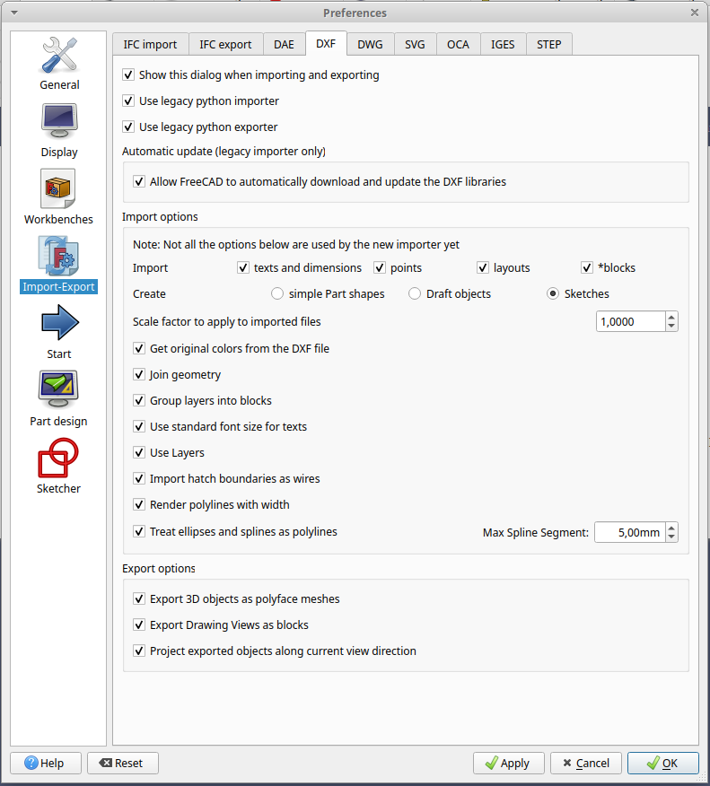
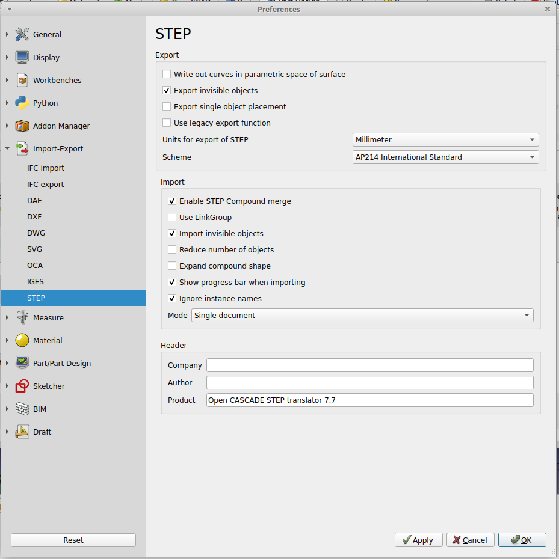
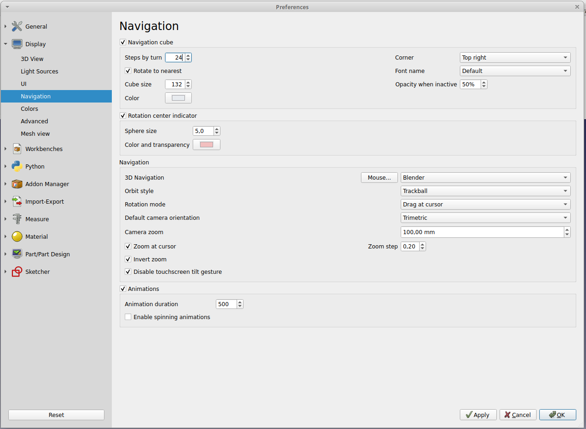

# Como configurar/instalar o `FreeCAD` ou o `freecad-realthunder` no `Linux Ubuntu`

## Resumo

Neste documento estão contidos os principais comandos e configurações para configurar/instalar o `FreeCAD` no `Linux Ubuntu`.

## _Abstract_

_In this document are contained the main commands and settings to set up/install the `FreeCAD` on `Linux Ubuntu`._

## Descrição [2]

### `FreeCAD`

O `FreeCAD` é uma poderosa e versátil plataforma de modelagem paramétrica 3D de código aberto, projetada principalmente para o design e modelagem de peças e conjuntos em engenharia mecânica e design de produtos. Com uma interface de usuário intuitiva e uma ampla gama de recursos, o `FreeCAD` permite criar modelos 3D precisos e detalhados. Ele suporta a criação de sólidos, superfícies, esboços 2D e montagens complexas, tornando-o uma ferramenta valiosa para projetistas, engenheiros e entusiastas de CAD. Além disso, o `FreeCAD` é altamente personalizável e possui uma comunidade ativa de desenvolvedores e usuários que contribuem com extensões e módulos para estender ainda mais sua funcionalidade, o que o torna uma opção popular para modelagem 3D no mundo do código aberto.

### `freecad-realthunder`

O `freecad-realthunder` é uma versão personalizada do FreeCAD, um software de modelagem 3D de código aberto, focado em aprimorar e expandir a funcionalidade do FreeCAD com novos recursos e melhorias. Desenvolvido por um usuário conhecido como RealThunder, esse fork do FreeCAD introduz melhorias na interface, estabilidade e desempenho, além de novas ferramentas para facilitar o trabalho com modelagem 3D paramétrica e outros tipos de design assistido por computador (CAD). O `freecad-realthunder` busca tornar o FreeCAD mais acessível e poderoso, com funcionalidades adicionais que podem ser úteis tanto para amadores quanto para profissionais da área de design e engenharia.

### `Path Workbench` [2]

O `Path Workbench` (ou Workbench de Caminho) é um dos ambientes de trabalho no FreeCAD, um software de modelagem 3D de código aberto. O `Path Workbench` é projetado para lidar com tarefas relacionadas à criação de trajetórias de ferramentas para máquinas CNC (Controle Numérico Computadorizado). Ele permite aos usuários gerar caminhos de ferramentas para usinagem CNC, incluindo fresamento e corte, definindo trajetórias e operações de usinagem para criar peças de trabalho precisas. O `Path Workbench` oferece ferramentas para criar geometria de corte, configurar parâmetros de usinagem, simular a usinagem e gerar código G para máquinas CNC. É uma ferramenta valiosa para engenheiros e projetistas que trabalham com fabricação CNC, permitindo a criação e a otimização de caminhos de ferramentas para produzir peças com precisão a partir de modelos 3D no FreeCAD.

### Add-on

Aqui está uma descrição dos add-ons listados para o **FreeCAD**:

#### `Add-on` obrigatório(s)

* **A2plus (obrigatório)**: Uma versão avançada do trabalho com assembleias no FreeCAD, permitindo criar e manipular montagens complexas.

* **AirPlaneDesign (obrigatório)**: Ferramentas específicas para o design de aviões, auxiliando na modelagem de estruturas aéreas.

* **Cfd (obrigatório)**: Ferramentas de dinâmica de fluidos computacional para análise e simulação de fluidos.

* **CfdOF (obrigatório)**: Integrando CFD (Computational Fluid Dynamics) com OpenFOAM, para simulações avançadas de fluido.

* **ExplodedAssembly (obrigatório)**: Criação de montagens explodidas para visualizar melhor as partes individuais de um modelo.

* **ModernUI (obrigatório)**: Oferece uma interface de usuário moderna para tornar o FreeCAD mais acessível e visualmente agradável.

* **SearchBar (obrigatório)**: Adiciona uma barra de pesquisa para facilitar a navegação e a busca por funções dentro do FreeCAD.

### Demais `Add-on`

* **3D_Printing_Tools**: Ferramentas para facilitar o processo de preparação de modelos 3D para impressão, incluindo ajustes e verificações.

* **3DfindIT**: Um repositório para buscar e inserir modelos 3D diretamente no FreeCAD, otimizando o design de projetos.

* **AnimationFreeCAD**: Permite a criação de animações para visualizar o movimento e as interações dos modelos no FreeCAD.

* **ArchTextures**: Um conjunto de texturas para uso em projetos arquitetônicos dentro do FreeCAD.

* **Assembly3**: Outro módulo para construção de montagens dentro do FreeCAD, com foco em facilitar a montagem e testes.

* **Assembly4**: Expansão do Assembly3, introduzindo mais funcionalidades para lidar com montagens mais complexas.

* **Autoload**: Um módulo que carrega automaticamente componentes específicos de um arquivo FreeCAD, simplificando o processo.

* **BCFPlugin**: Ferramenta para exportar e importar arquivos de feedback de construção (BCF), útil para colaboração em projetos.

* **BIM**: Módulo voltado para Building Information Modeling (BIM), facilitando a criação de modelos arquitetônicos e de engenharia.

* **BIMBots**: Automatiza diversas tarefas no processo de design BIM dentro do FreeCAD.

* **CADExchanger**: Ferramenta para importar e exportar modelos CAD de e para o FreeCAD.

* **CommandPanel**: Interface para aumentar a produtividade no FreeCAD, fornecendo acesso rápido a funções e comandos.

* **CubeMenu**: Um menu de atalho personalizável para agilizar o uso do FreeCAD.

* **CurvedShapes**: Ferramentas para criar formas curvas avançadas no FreeCAD.

* **Curves**: Módulo para criar e manipular curvas e linhas complexas.

* **Defeaturing**: Ferramenta que ajuda a remover ou simplificar elementos desnecessários de um modelo 3D.

* **Design456**: Ferramentas para a modelagem de componentes mecânicos e outras áreas do design técnico.

* **DesignSPHysics**: Integrando o FreeCAD com SPHysics para simulações físicas baseadas em partículas.

* **DynamicData**: Sistema para gerenciar dados dinâmicos e parâmetros em projetos do FreeCAD.

* **EM**: Ferramentas para modelagem e simulação de circuitos e sistemas elétricos.

* **Estimate**: Estimativas de custo e tempo para projetos no FreeCAD, visando facilitar o planejamento.

* **ExtMan**: Extensão para gerenciar a instalação e a atualização de módulos e extensões no FreeCAD.

* **FEM_FrontISTR**: Integrando ferramentas para análise de elementos finitos (FEM) com o software FrontISTR.

* **FEMbyGEN**: Uma abordagem alternativa para a análise FEM, gerando soluções para simulações de engenharia.

* **FeedsAndSpeeds**: Auxilia no cálculo de parâmetros de corte para operações de usinagem.

* **FrameForge**: Ferramenta para a criação e simulação de estruturas de quadro e componentes metálicos.

* **FreeCAD-Beginner-Assistant**: Assistente para iniciantes no FreeCAD, ajudando novos usuários a aprenderem a usar o software.

* **FreeGrid**: Adiciona a funcionalidade de grid para facilitar o desenho e a modelagem de objetos no FreeCAD.

* **GDML**: Módulo para importar e exportar arquivos GDML, frequentemente utilizado em física de partículas.

* **GDT**: Ferramenta para criação de tolerâncias geométricas e dimensionamento de componentes.

* **Glass**: Ferramentas para modelagem de objetos de vidro, facilitando a criação de elementos transparentes.

* **Help**: Um módulo para integrar documentação e ajuda diretamente no ambiente do FreeCAD.

* **IconThemes**: Oferece pacotes de ícones temáticos para personalizar a aparência do FreeCAD.

* **ImportNURBS**: Ferramenta para importar modelos NURBS (Non-Uniform Rational B-Splines) em FreeCAD.

* **InventorLoader**: Permite importar arquivos do Autodesk Inventor para o FreeCAD.

* **LCInterlocking**: Ferramenta para modelagem de sistemas de interligação de ferrovias.

* **Launcher**: Um lançador para abrir o FreeCAD com configurações específicas de projeto ou módulo.

* **Lithophane**: Criação de modelos 3D que podem ser impressos em forma de litofania (imagens em relevo).

* **MOOC**: Ferramenta de aprendizagem para usuários do FreeCAD com cursos e tutoriais integrados.

* **MakerWorkbench**: Ferramentas para criadores e makers, facilitando a criação de protótipos no FreeCAD.

* **Manipulator**: Oferece funcionalidades adicionais para manipular e ajustar modelos 3D no FreeCAD.

* **Marz**: Módulo para design mecânico avançado, com recursos adicionais de modelagem de componentes.

* **MeshRemodel**: Ferramentas para remodelagem de malhas, ideal para trabalhar com arquivos de malha 3D.

* **MnesarcoUtils**: Um conjunto de utilitários úteis para melhorar a experiência no FreeCAD.

* **NavigationIndicator**: Ferramenta para indicar e controlar a navegação em grandes modelos 3D.

* **Nodes**: Introduz a programação visual com nós (Node-based programming) para modelagem dentro do FreeCAD.

* **OpticsWorkbench**: Ferramentas para modelagem de sistemas ópticos e simulações relacionadas.

* **POV-Ray-Rendering**: Integra o FreeCAD com o renderizador POV-Ray para criar imagens de alta qualidade a partir de modelos 3D.

* **Part-o-magic**: Oferece funcionalidades avançadas para modelagem de peças mecânicas com formas complexas.

* **PieMenu**: Um menu radial personalizável para acesso rápido a ferramentas e funções no FreeCAD.

* **Plot**: Ferramentas para gerar gráficos e plotagens a partir de dados numéricos ou simulações.

* **Pyramids-and-Polyhedrons**: Ferramentas para criação de pirâmides e poliedros em modelagem 3D.

* **Quetzal**: Um novo módulo que adiciona funcionalidades adicionais de modelagem e design no FreeCAD.

* **Reinforcement**: Ferramenta para calcular e modelar a armadura de estruturas de concreto e outros materiais.

* **RemBench**: Ferramenta voltada para benchmarking e medição de desempenho de simulações e modelos no FreeCAD.

* **Render**: Um módulo para renderizar visualmente os modelos 3D no FreeCAD, proporcionando imagens realistas.

* **Reporting**: Ferramenta para gerar relatórios detalhados sobre os projetos e simulações realizadas no FreeCAD.

* **Rocket (obrigatório)**: Ferramentas específicas para design de foguetes e sistemas de propulsão.

* **STEMFIE**: Módulo voltado para educação e ensino de ciências, facilitando o uso do FreeCAD em ambientes de aprendizagem.

* **SelectorToolbar**: Um painel de ferramentas para facilitar a seleção e modificação de objetos e componentes no FreeCAD.

* **Ship**: Ferramentas dedicadas à modelagem de navios e embarcações no FreeCAD.

* **ShortCuts**: Oferece atalhos personalizados para melhorar a eficiência e a produtividade ao usar o FreeCAD.

* **Silk**: Ferramentas para criar superfícies e formas curvas de alta precisão no FreeCAD.

* **SlopedPlanesMacro**: Macro para criar e manipular planos inclinados em modelos 3D.

* **SteelColumn**: Ferramenta específica para modelagem de colunas de aço e outros elementos estruturais.

* **TabBar**: Modifica a interface do FreeCAD, adicionando uma barra de abas para facilitar a navegação entre documentos.

* **ThreadProfile**: Permite criar e manipular perfis de rosca no FreeCAD.

* **ToolbarStyle**: Personaliza o estilo e o comportamento das barras de ferramentas do FreeCAD.

* **Trails**: Ferramenta para criar e visualizar trilhas e caminhos em modelos 3D.

* **WebTools**: Conjunto de ferramentas para integrar o FreeCAD com tecnologias e serviços web.

* **Woodworking**: Módulo específico para modelagem e design de peças de madeira, ideal para carpinteiros e marc


## 1. Como configurar/instalar/usar o `FreeCAD` ou o `freecad-realthunder` no `Linux Ubuntu` [1]

### 1.1 `FreeCAD`

Para configurar/instalar/usar o `FreeCAD`, você pode seguir estas etapas:

1. Abra o `Terminal Emulator`. Você pode fazer isso pressionando: `Ctrl + Alt + T`


2. Certifique-se de que seu sistema esteja limpo e atualizado.

    2.1 Limpar o `cache` do gerenciador de pacotes `apt`. Especificamente, ele remove todos os arquivos de pacotes (`.deb`) baixados pelo `apt` e armazenados em `/var/cache/apt/archives/`. Digite o seguinte comando: `sudo apt clean` 
    
    2.2 Remover pacotes `.deb` antigos ou duplicados do cache local. É útil para liberar espaço, pois remove apenas os pacotes que não podem mais ser baixados (ou seja, versões antigas de pacotes que foram atualizados). Digite o seguinte comando: `sudo apt autoclean`

    2.3 Remover pacotes que foram automaticamente instalados para satisfazer as dependências de outros pacotes e que não são mais necessários. Digite o seguinte comando: `sudo apt autoremove -y`

    2.4 Buscar as atualizações disponíveis para os pacotes que estão instalados em seu sistema. Digite o seguinte comando e pressione `Enter`: `sudo apt update`

    2.5 **Corrigir pacotes quebrados**: Isso atualizará a lista de pacotes disponíveis e tentará corrigir pacotes quebrados ou com dependências ausentes: `sudo apt --fix-broken install`

    2.6 Limpar o `cache` do gerenciador de pacotes `apt`. Especificamente, ele remove todos os arquivos de pacotes (`.deb`) baixados pelo `apt` e armazenados em `/var/cache/apt/archives/`. Digite o seguinte comando: `sudo apt clean` 
    
    2.7 Para ver a lista de pacotes a serem atualizados, digite o seguinte comando e pressione `Enter`:  `sudo apt list --upgradable`

    2.8 Realmente atualizar os pacotes instalados para as suas versões mais recentes, com base na última vez que você executou `sudo apt update`. Digite o seguinte comando e pressione `Enter`: `sudo apt full-upgrade -y`
    

3. Instale o `FreeCAD` usando o comando a seguir: `sudo apt install freecad -y`

    Aguarde o processo de instalação ser concluído. O sistema irá baixar e instalar o `FreeCAD` e suas dependências.

4. Após a instalação, você pode abrir o `FreeCAD` a partir do menu de aplicativos do `Linux Ubuntu` ou executando o seguinte comando no `Terminal Emulator`: `freecad`

Agora, o `FreeCAD` estará instalado e pronto para uso no seu sistema `Linux Ubuntu`.


### 1.1.1 Codigo completo para configurar/instalar/usar

Para configurar/instalar/usar o `FreeCAD` no `Linux Ubuntu` sem precisar digitar linha por linha, você pode seguir estas etapas:

1. Abra o `Terminal Emulator`. Você pode fazer isso pressionando: `Ctrl + Alt + T`

2. Digite o seguinte comando e pressione `Enter`:

    ```
    sudo apt clean
    sudo apt autoclean
    sudo apt autoremove -y
    sudo apt update
    sudo apt --fix-broken install
    sudo apt clean
    sudo apt list --upgradable
    sudo apt full-upgrade -y
    sudo apt install freecad -y
    ```


### 1.2 `freecad-realthunder`

Para configurar/instalar/usar o `freecad-realthunder`, você pode seguir estas etapas:

1. Abra o `Terminal Emulator`. Você pode fazer isso pressionando: `Ctrl + Alt + T`

2. Certifique-se de que seu sistema esteja limpo e atualizado.

    2.1 Limpar o `cache` do gerenciador de pacotes `apt`. Especificamente, ele remove todos os arquivos de pacotes (`.deb`) baixados pelo `apt` e armazenados em `/var/cache/apt/archives/`. Digite o seguinte comando: `sudo apt clean` 
    
    2.2 Remover pacotes `.deb` antigos ou duplicados do cache local. É útil para liberar espaço, pois remove apenas os pacotes que não podem mais ser baixados (ou seja, versões antigas de pacotes que foram atualizados). Digite o seguinte comando: `sudo apt autoclean`

    2.3 Remover pacotes que foram automaticamente instalados para satisfazer as dependências de outros pacotes e que não são mais necessários. Digite o seguinte comando: `sudo apt autoremove -y`

    2.4 Buscar as atualizações disponíveis para os pacotes que estão instalados em seu sistema. Digite o seguinte comando e pressione `Enter`: `sudo apt update`

    2.5 **Corrigir pacotes quebrados**: Isso atualizará a lista de pacotes disponíveis e tentará corrigir pacotes quebrados ou com dependências ausentes: `sudo apt --fix-broken install`

    2.6 Limpar o `cache` do gerenciador de pacotes `apt`. Especificamente, ele remove todos os arquivos de pacotes (`.deb`) baixados pelo `apt` e armazenados em `/var/cache/apt/archives/`. Digite o seguinte comando: `sudo apt clean` 
    
    2.7 Para ver a lista de pacotes a serem atualizados, digite o seguinte comando e pressione `Enter`:  `sudo apt list --upgradable`

    2.8 Realmente atualizar os pacotes instalados para as suas versões mais recentes, com base na última vez que você executou `sudo apt update`. Digite o seguinte comando e pressione `Enter`: `sudo apt full-upgrade -y`
    

3. **Baixe o `AppImage` do `FreeCAD-RealThunder`**: Use o comando abaixo para baixar a versão mais recente diretamente do `GitHub`:

    ```
    wget https://github.com/realthunder/FreeCAD_assembly3/releases/download/LinkDaily/FreeCAD-asm3-Daily-Conda-x86_64.AppImage
    ```

4. **Torne o `AppImage` executável**: Após o _download_, torne o arquivo executável:

    ```
    chmod +x FreeCAD-asm3-Daily-Conda-x86_64.AppImage
    ```

5. **Execute o `FreeCAD-RealThunder`**: Execute o `AppImage` diretamente:

    ```
    ./FreeCAD-asm3-Daily-Conda-x86_64.AppImage
    ```

**Funcionalidades Adicionais**

* **Interface de Usuário Melhorada**: O `RealThunder` apresenta ajustes na interface, como filtros de seleção e opções aprimoradas para navegação e manipulação.

* **Recursos Avançados**: Inclui novas ferramentas e funcionalidades que não estão disponíveis na versão oficial do `FreeCAD`, como melhorias em _workbenches_ e novas opções para modelagem.

* **Mais Rápido e Estável**: Usuários relatam que o `RealThunder` oferece um desempenho mais estável e rápido em modelos grandes ou complexos.

### 1.2 Codigo completo para configurar/instalar/usar

Para configurar/instalar/usar o `FreeCAD` no `Linux Ubuntu` sem precisar digitar linha por linha, você pode seguir estas etapas:

1. Abra o `Terminal Emulator`. Você pode fazer isso pressionando: `Ctrl + Alt + T`

2. Digite o seguinte comando e pressione `Enter`:

    ```
    sudo apt clean
    sudo apt autoclean
    sudo apt autoremove -y
    sudo apt update
    sudo apt --fix-broken install
    sudo apt clean
    sudo apt list --upgradable
    sudo apt full-upgrade -y
    wget https://github.com/realthunder/FreeCAD_assembly3/releases/download/LinkDaily/FreeCAD-asm3-Daily-Conda-x86_64.AppImage
    chmod +x FreeCAD-asm3-Daily-Conda-x86_64.AppImage
    ./FreeCAD-asm3-Daily-Conda-x86_64.AppImage
    ```


## 2. Instalar um Add-on manualmente

Para instalar um Add-on manualmente no `FreeCAD` em uma rede corporativa que bloqueia o acesso ao GitHub, você pode fazer o download do Add-on em outro computador ou rede que tenha acesso ao GitHub e depois transferi-lo para a máquina onde o `FreeCAD` está instalado. Aqui estão os passos:

### Baixe o Add-on manualmente

1. **Acesse o Repositório do Add-on no `GitHub`**: Visite a página oficial de Add-ons do `FreeCAD` ou o repositório específico do Add-on que deseja instalar. Por exemplo: FreeCAD Addons Repository: <https://github.com/FreeCAD/FreeCAD-addons>

2. **Baixe o Add-on**:

    2.1 No repositório do Add-on, clique em `Code` e escolha `Download ZIP`.

    2.2 Salve o arquivo ZIP em um dispositivo de armazenamento ou transfira-o para a máquina onde o `FreeCAD` está instalado.

### Extraia o Add-on

1. Copie o arquivo ZIP para o computador com o `FreeCAD`.

2. Extraia o conteúdo do ZIP para o diretório onde os Add-ons do `FreeCAD` estão armazenados:

    * **Linux**: Normalmente em `~/snap/freecad/current/.FreeCAD/Mod`

        * Se percisar, utilize comandos no `Terminal Emulator` com o uso do `sudo` para criar a pasta e realizar a cópia das pastas.

    * **Windows**: Normalmente em `%APPDATA%\FreeCAD\Mod\`

    * **MacOS**: Normalmente em `~/Library/Preferences/FreeCAD/Mod/`

    Se o diretório `Mod` não existir, você pode criá-lo manualmente.

### Verifique se o Add-on Foi Reconhecido

1. Abra o `FreeCAD`.

2. Navegue até o menu de Workbenches (bancadas de trabalho).

3. Verifique se a nova bancada de trabalho ou `Add-on` aparece na lista.

### Configurações Manuais (Se Necessário)

Alguns Add-ons podem exigir dependências adicionais (como bibliotecas `Python`). Leia o arquivo README.md do Add-on no repositório para verificar as instruções de instalação e dependências.

Para instalar dependências manualmente:

1. Use o `pip` para instalar bibliotecas `Python`:

```
pip install nome_da_biblioteca
```

### Manutenção

Como você está instalando os Add-ons manualmente, será necessário verificar atualizações periodicamente no repositório do Add-on, já que ele não será atualizado automaticamente pelo gerenciador do `FreeCAD`.


## 3.1 Ativar o `ModerUI` no `FreeCAD` [3]

Para ativar o `ModerUI` no `FreeCAD`, você precisa seguir alguns passos simples. O `ModerUI` é um ambiente de trabalho (_workbench_) que proporciona uma interface mais moderna e simplificada para o `FreeCAD`. Aqui estão os passos para ativá-lo:

1. **Abra o `FreeCAD`:** Inicie o `FreeCAD` no seu computador.

2. **Verifique se o `ModerUI` está instalado:** O `ModerUI` pode **NÃO** estar pré-instalado no `FreeCAD`. Para verificar isso, vá até a barra de menu e clique em:
    
    2.1 `"View"` > `"Workbenche"` (ou `"Ambiente de Trabalho"`).
    
    Se o `ModerUI` estiver na lista, você pode pular o passo 4.

3. **Instale o `ModerUI` (se necessário):** Se o `ModerUI` **NÃO** estiver na lista de ambientes de trabalho, você precisará instalá-lo. Para isso:

    3.1 Vá até o menu `Tools` (ou `Ferramentas`);
    
    3.2 `Addon Manager` (ou `Gerenciador de Complementos`).
    
    3.3 Procure por `ModerUI` na lista de complementos disponíveis e clique em `Install` (`Instalar`).

4. **Ative o `ModerUI`:** Após a instalação, você pode ativar o `ModerUI`. Vá novamente até a barra de menu, clique em: `"Ver" > "Ambientes de Trabalho" e selecione "ModerUI"`.

5. **Explore a nova interface:** Com o `ModerUI` ativado, você notará uma mudança na interface do `FreeCAD`, com uma aparência mais moderna e talvez um conjunto diferente de ferramentas e opções disponíveis.

Lembre-se de que as versões do `FreeCAD` e dos complementos podem variar, então os passos exatos podem ser um pouco diferentes dependendo da versão que você está usando. Se tiver dificuldades, consulte a documentação do `FreeCAD` ou fóruns da comunidade para obter ajuda específica para a sua versão.


### 3.2 Ativar o `A2plus` no `FreeCAD` [4]

Para ativar o `A2plus` no `FreeCAD`, você precisa seguir alguns passos simples. O `A2plus` é um workbench (bancada de trabalho) dentro do `FreeCAD` que permite o trabalho com montagens mecânicas. Aqui está o processo:

1. **Instalação do `A2plus`:** Primeiro, certifique-se de que o `FreeCAD` esteja instalado no seu computador.

    1.1 Abra o `FreeCAD`.

    1.2 Vá até o menu `Tools` e selecione `Addon Manager`.

    1.3 Na janela do `Addon Manager`, procure por `A2plus` na lista de workbenches disponíveis.

    1.4 Clique em `A2plus` e depois no botão Instalar.

    1.5 Aguarde a conclusão da instalação e reinicie o `FreeCAD`.

2. **Ativação do `A2plus`:**

    2.1 Após reiniciar o `FreeCAD`, clique no menu de seleção de workbenches (geralmente localizado no canto superior direito da janela do `FreeCAD`, com um ícone de uma pequena casa ou uma lista de ícones).

    2.2 Selecione `A2plus` na lista de workbenches disponíveis.

    Com isso, o workbench `A2plus` será ativado e você poderá começar a usar suas funcionalidades para montagens.

3. **Utilização do `A2plus`:**

    3.1 Com o `A2plus` ativo, você terá acesso a várias ferramentas específicas para montagem de peças.

    3.2 Explore as ferramentas disponíveis na barra de ferramentas do `A2plus` para começar a montar suas peças.

    3.3 Caso encontre algum problema durante a instalação ou a utilização do `A2plus`, consulte a documentação do FreeCAD ou fóruns da comunidade para obter ajuda adicional.

### 3.3 `Path Workbench`

Para habilitar e usar o `Path Workbench` no `FreeCAD`, siga os passos abaixo. Vou assumir que você já tem o `FreeCAD` instalado no seu sistema. Se não tiver, você precisará instalar o `FreeCAD` primeiro.

**Passos para Habilitar o `Path Workbench` no `FreeCAD`**

1. **Abrir o `FreeCAD`:** Inicie o `FreeCAD` no seu computador.

2. **Selecionar o `Path Workbench`:**

    - Na interface do `FreeCAD`, você encontrará uma barra de menu na parte superior ou uma lista de _workbenches_ na lateral (a disposição pode variar dependendo da versão do `FreeCAD` e das suas configurações de interface).

    - Procure pelo ícone do `Path Workbench`, que geralmente tem um símbolo de uma ferramenta de corte ou um caminho de ferramenta. O ícone pode ser encontrado na lista de workbenches disponíveis.

    - Clique no ícone do `Path Workbench` para ativá-lo.

3. **Familiarize-se com a Interface:**

    - Uma vez no `Path Workbench`, você verá um conjunto de ferramentas específicas para operações de CAM.

    - A interface incluirá opções para criar novas operações de caminho, configurar ferramentas e materiais, e gerar simulações de caminhos de ferramentas.

4. **Criar ou Importar um Desenho:**

    - Antes de criar caminhos de ferramentas, você precisa ter um modelo 3D. Você pode criar um novo desenho usando outro workbench do `FreeCAD`, como o PartDesign, ou importar um desenho existente.

    - Certifique-se de que o desenho esteja pronto e apropriado para as operações de usinagem.

5. **Usar as Ferramentas do `Path Workbench`:**

    - Utilize as ferramentas do `Path Workbench` para criar operações de caminho, como contornar, perfurar, gravar, etc.

    - Configure as propriedades de cada operação, como profundidade, velocidade de corte, e seleção de ferramenta.

- **Prática e Experimentação:** Como qualquer ferramenta poderosa, o Path Workbench tem uma curva de aprendizado. Pratique com projetos simples para se familiarizar com as funcionalidades e capacidades do workbench.

Ao seguir estes passos, você será capaz de ativar e começar a usar o Path Workbench no FreeCAD para suas necessidades de CAM.


## 5. Importar outros tipos de arquivo CAD no `FreeCAD`

O `FreeCAD` suporta a abertura de diversos arquivos compatíveis com CAD. Para abrir importar um arquivo no `FreeCAD`, siga os passos abaixo:

1. **Abra o `FreeCAD`**: Execute o `FreeCAD`.

2. **Importe o Arquivo**:

    2.1 No menu superior, clique em `File` (`Arquivo`).

    2.2 Selecione `Open...` (`Abrir...`).

    2.3 Navegue até o local onde o arquivo está armazenado.

    2.4 Selecione o arquivo e clique em `Open` (`Abrir`).

3. **Configurações Adicionais (opcional)**:

    3.1 Às vezes, pode ser necessário configurar algumas opções de importação para obter melhores resultados. Isso pode ser feito em `Edit` (`Editar`) -> `Preferences` (`Preferências`) -> `Import-Export` (`Importação-Exportação`).

    3.2 No painel `Import-Export`, clique ena aba do arquivo a ser importado para ajustar as preferências de importação de arquivos.

4. **Verifique o Conteúdo**: Após a importação, você deve ver o conteúdo do arquivo importado na área de trabalho do `FreeCAD`.

Se você encontrar algum problema durante a importação, verifique as configurações de importação no menu de preferências e ajuste conforme necessário. O `FreeCAD` possui várias opções para lidar com diferentes versões e variações do formato compatíveis com CAD.

5. **Certifique-se de que o Sólido é Válido**: Verifique se o Objeto é um Sólido:

    5.1 Selecione o sólido ou o componente correspondente na árvore de modelos.

    5.2 Vá para o menu `Part → Check Geometry` para confirmar que o objeto é um sólido válido.

    5.3 Se houver problemas, corrija a geometria antes de proceder.


### 5.1 IFC import

1. **Mostrar esse diálogo quando importar e exportar**: Ativado

### 5.2 IFC export

1. **Mostrar esse diálogo quando importar e exportar**: Ativado

### 5.3 DAE

1. **Mostrar esse diálogo quando importar e exportar**: Ativado


### 5.4 DXF

<div style="text-align: center;">
    
</div>

Para importar arquivos `DXF` no `FreeCAD` de forma eficiente, a configuração das opções de importação pode depender do tipo de arquivo `DXF` que você está importando e do que você pretende fazer com ele após a importação. Aqui estão algumas recomendações baseadas nas opções disponíveis na sua imagem:

1. **Mostrar esse diálogo quando importar e exportar**: Ativado

2. **Importar textos e dimensões, pontos, _layouts_, blocos**:

    - **Importar textos e dimensões**: Ativado, se o seu DXF contiver textos e dimensões importantes.

    - **Pontos**: Ativado, se o seu DXF contiver pontos de referência importantes.

    - **Layouts**: Ativado, se você precisar importar layouts além do modelo principal.

    - **Blocos**: Ativado, se o seu DXF contiver blocos que você precisa preservar.

3. **Criar**:

    - **Simple Part shapes**: Desativado, adequado para a maioria das importações básicas.

    - **Draft objects**: Desativado, escolha essa opção se você precisar editar os objetos importados como entidades de rascunho no FreeCAD.

    - **Sketches**: Ativado, util se você precisar trabalhar com esboços para operações de modelagem paramétrica.

4. **Fator de escala para aplicar aos arquivos importados**: Mantenha o valor padrão (1.0000) a menos que você precise ajustar a escala do seu desenho importado.

5. **Obter cores originais do arquivo DXF**: Ativado, se você precisar manter as cores originais dos elementos no DXF.

6. **Unir geometria**: Ativado, se você quiser unir linhas e curvas que se tocam em uma única entidade. Útil para limpeza de desenhos.

7. **Agrupar camadas em blocos**: Ativado, se você quiser que as camadas do DXF sejam agrupadas em blocos no FreeCAD.

8. **Usar tamanho de fonte padrão para textos**: Ativado, se você quiser que todos os textos sejam importados com um tamanho de fonte padrão.

9. **Usar camadas**: Ativado, se você quiser preservar a estrutura de camadas do arquivo DXF.

10. **Importar limites de_hachuras como _wires_**: Ativado, se você precisar das hachuras como limites no `FreeCAD`.

11. **Renderizar polilinhas com largura**: Ativado, se você quiser que as polilinhas mantenham suas larguras originais.

12. **Tratar elipses e _splines_ como polilinhas**: Ativado, se você precisar converter _splines_ e elipses em polilinhas para compatibilidade.

13. **Segmento máximo da _spline_**: Ajuste conforme necessário. Um valor menor resulta em mais segmentos, aumentando a precisão, mas também a complexidade do modelo.

14. **Opções de exportação**:

    - **Exportar visualizações de desenhos como blocos**: Ativado, para manter os blocos ao exportar.

    - As outras opções de exportação podem ser desativadas a menos que você tenha uma necessidade específica.

Essas configurações devem proporcionar uma boa base para a maioria das importações de arquivos DXF. Você pode ajustar conforme necessário com base no conteúdo específico dos seus arquivos DXF e no fluxo de trabalho desejado no `FreeCAD`.

### 5.5 DWG

1. **Mostrar esse diálogo quando importar e exportar**: Ativado

### 5.6 SVG

1. **Mostrar esse diálogo quando importar e exportar**: Ativado

### 5.7 OCA

1. **Mostrar esse diálogo quando importar e exportar**: Ativado

### 5.8 IGES

1. **Mostrar esse diálogo quando importar e exportar**: Ativado

### 5.9 STEP

<div style="text-align: center;">
    
</div>

1. **Mostrar esse diálogo quando importar e exportar**: Ativado


## 6. Ajustar o ângulo de rotação

<div style="text-align: center;">
    
</div>

O `"Steps by turn"` realmente controla o número de passos para completar uma rotação de 360 graus no **Navigation Cube**. Alterando esse valor, você ajusta a precisão dos giros.

1. Divida 360 graus pelo número de passos que você deseja. Para 15 graus por giro:

    * 360 ÷ 15 = 24 passos.

Você pode ajustar diretamente o campo Steps by turn e clicar em `Apply` para aplicar a alteração.

## 6. Desinstalar o `FreeCAD`

1. Se você preferir, pode remover o `FreeCAD 0.19` antes de instalar a nova versão:

    ```
    sudo apt remove freecad freecad-common
    sudo apt autoremove
    ```


## Referências

[1] OPENAI. ***Instalar freecad 0.19 no ubuntu.*** Disponível em: <https://chat.openai.com/c/f3fbd8b3-8f3c-478f-9cda-568f7da146d8> (texto adaptado). ChatGPT. Acessado em: 16/11/2023 10:06.

[2] OPENAI. ***Vs code: editor popular.*** Disponível em: <https://chat.openai.com/c/b640a25d-f8e3-4922-8a3b-ed74a2657e42> (texto adaptado). ChatGPT. Acessado em: 16/11/2023 10:06.

[3] OPENAI. ***Ativar ModerUI no freecad.*** Disponível em: <https://chat.openai.com/c/7d74a9a2-f569-4ef0-8e2b-3421e67dc053> (texto adaptado). ChatGPT. Acessado em: 05/12/2023 20:07. 

[4] OPENAI. ***Ativar a2plus no freecad.*** Disponível em: <https://chat.openai.com/c/51b969b1-a80b-48fa-84dc-4f019ba41ba7> (texto adaptado). ChatGPT. Acessado em: 05/12/2023 20:08.
